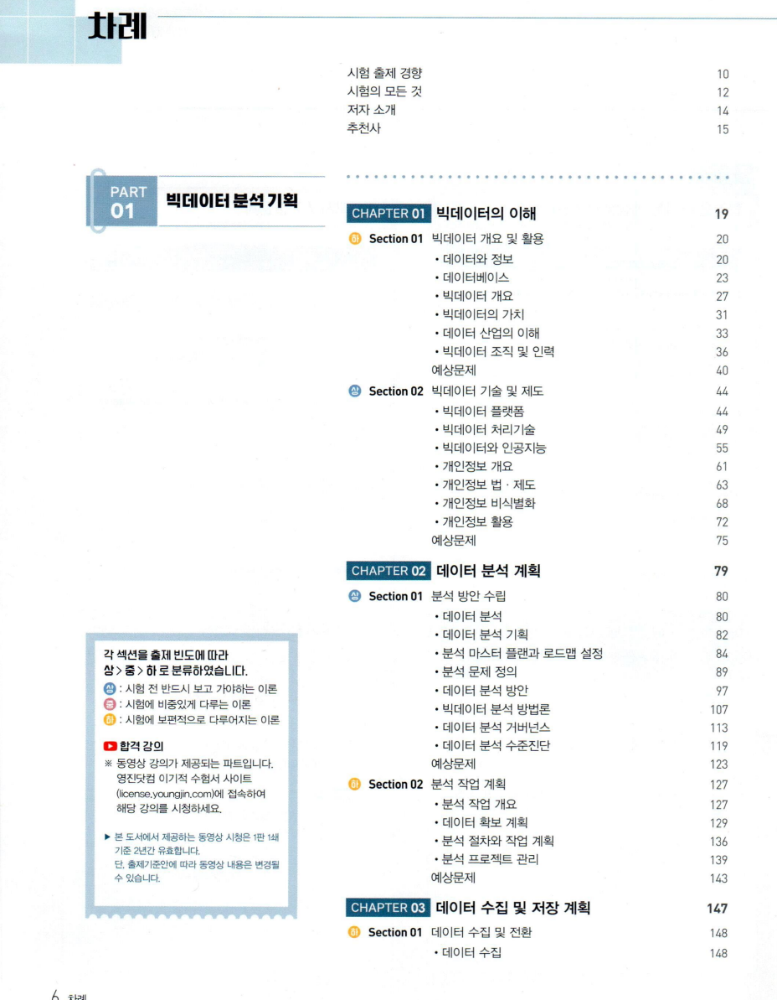
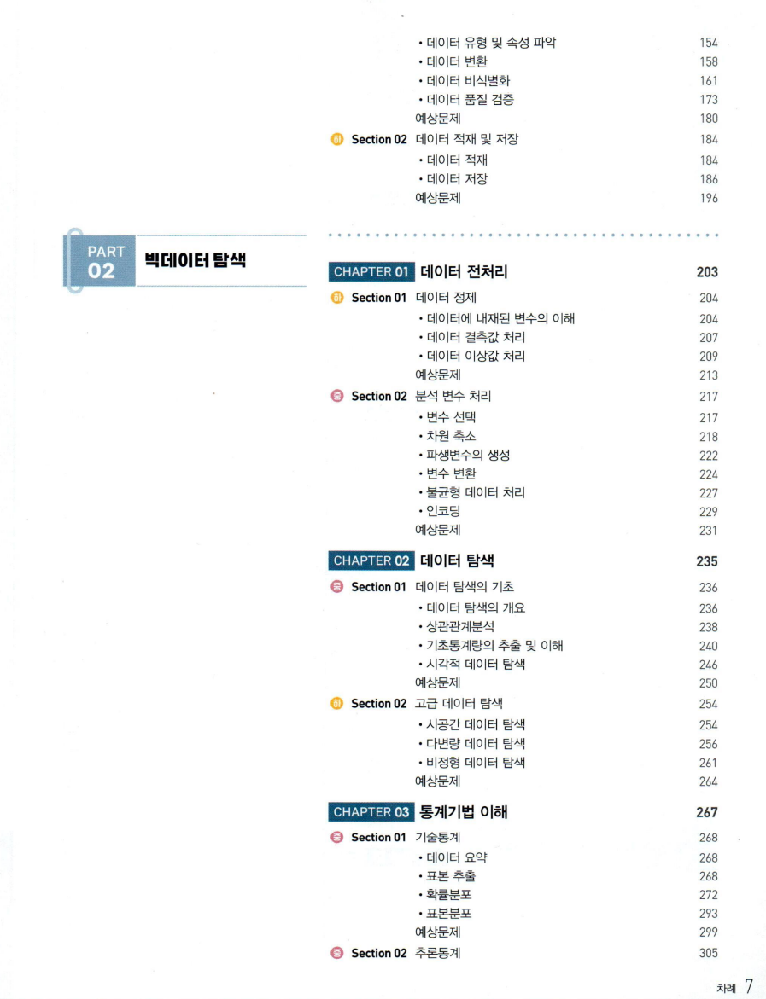

# 책 카테고리

1. <a href="#it">정보처리기사</a>  
2. <a href="#data">빅데이터분석기사</a>  
3. <a href="#economy">경영정보시각화능력</a>  

# 정보처리기사 자격증

<a id="it">it</a>

# 빅데이터 분석기사 자격증
<a id="data">data</a>

# 경영정보시각화능력 자격증
<a id="economy">economy</a>

